# eLearn: Online Education Platform

This is a full-stack e-learning platform with separate client and server applications.

## 📸 Screenshots

### 🔐 Login & Signup

<p float="left">
  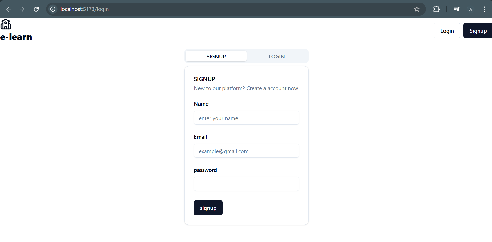

</p>

---

### 🏠 Landing Page

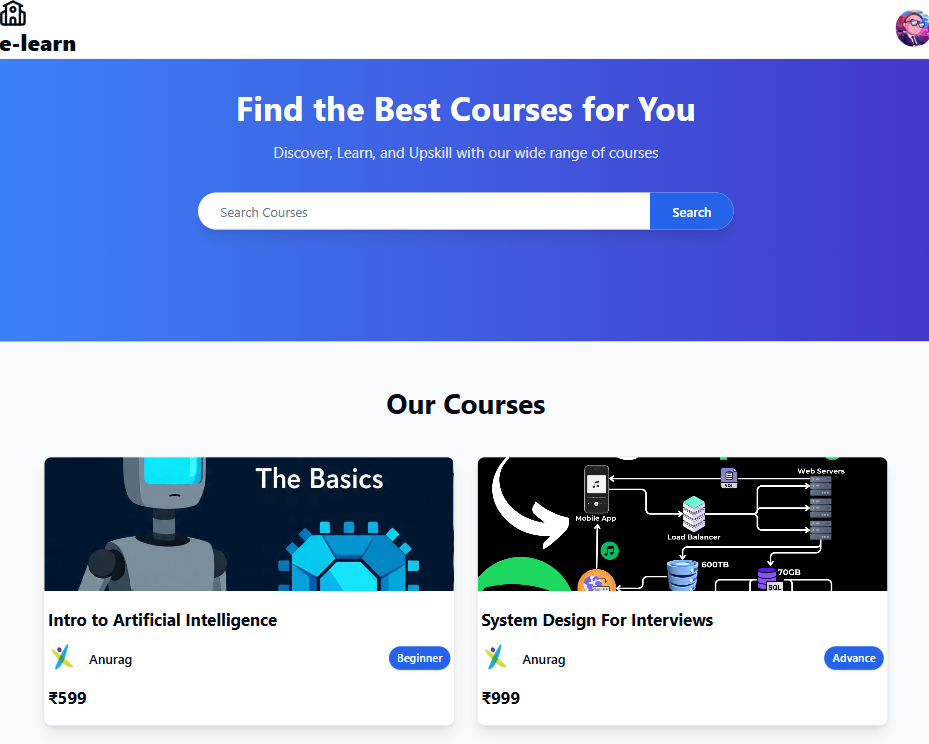

Homepage with featured courses and Navbar.

---

### 👤 Profile Page

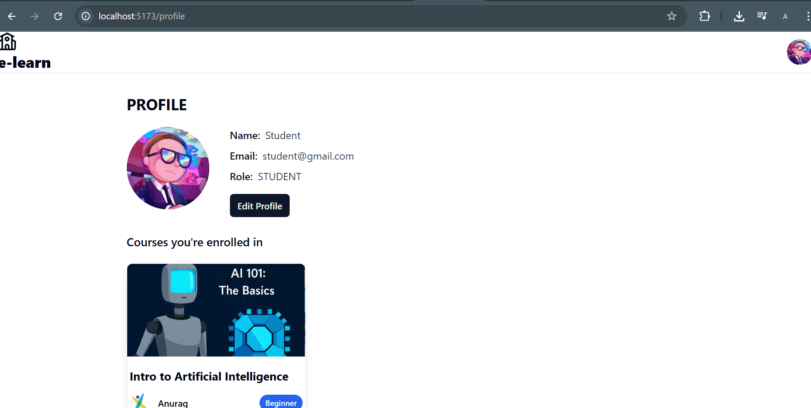

Displays user information and enrolled courses.

---

### 🔍 Search Courses

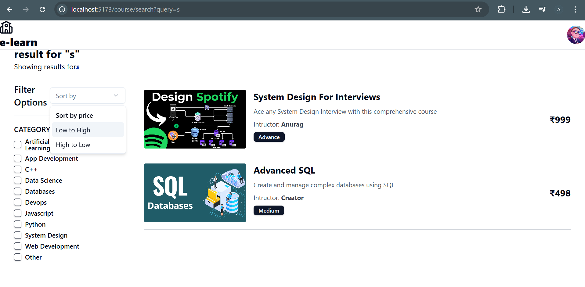

Allows users to explore and filter courses by category or keyword.

---

### 📘 Course Details & 🎥 Lecture Page

<p float="left">
  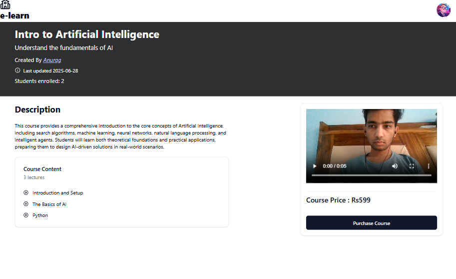
  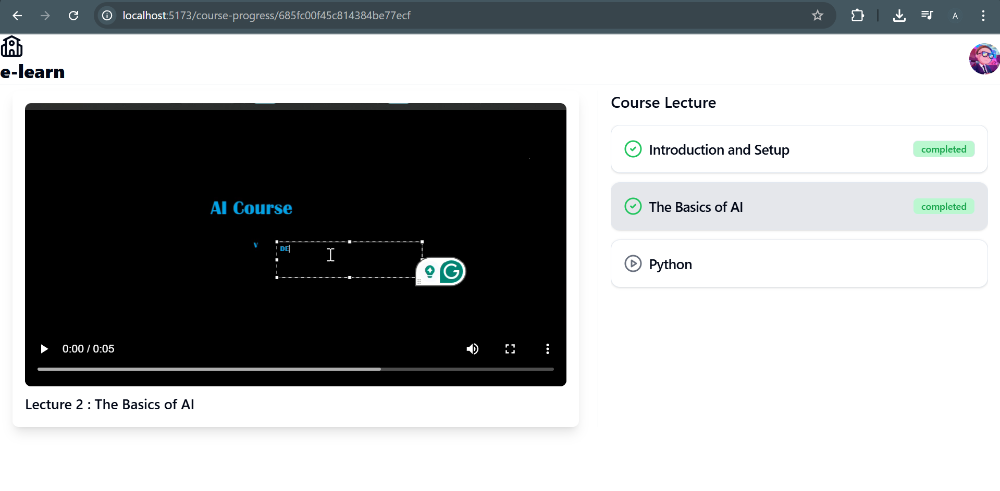
</p>


Detailed view of a course with curriculum, and the video lecture playback interface.

---

### 🧑‍🏫 Instructor Features – Creating Courses & Lectures

> The following features are accessible only to users with the **instructor** role.

<p float="left">
  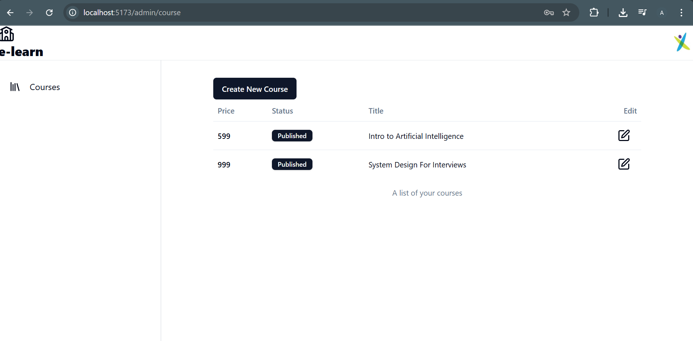
  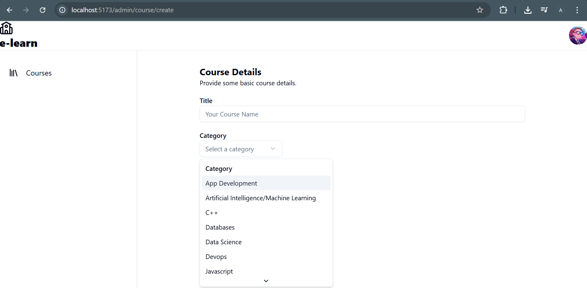
 
</p>
<p float="left">
  
  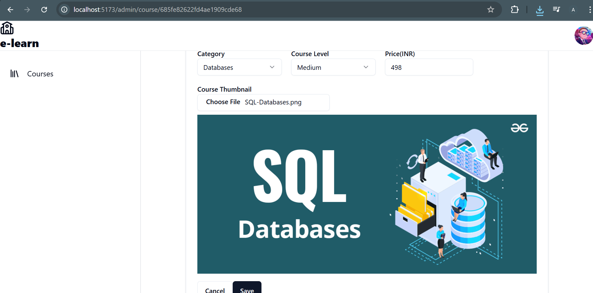
 
</p>
<p float="left">
  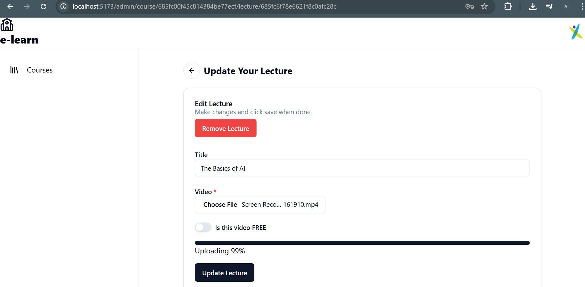
  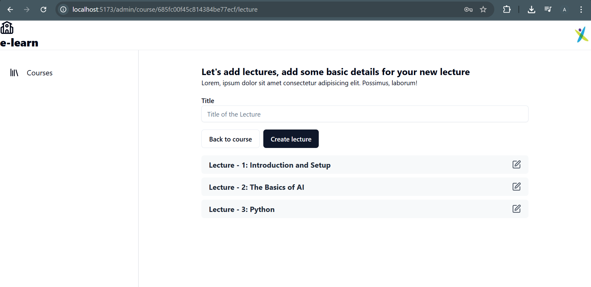
 
</p>

Instructors can create new courses, add lecture videos, and manage course content.

```

